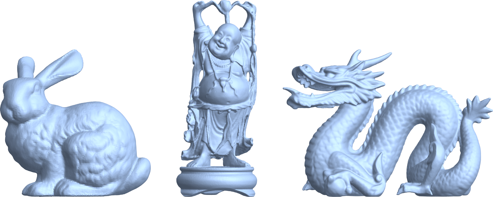

## Wrapping Cycles in Delaunay Complexes

The code in this repository can be used to produce the most persistent features of the Delaunay filtration associated to a point cloud as PLY files. It accompanies the following joint work.

> Bauer, U. and Roll, F. (2023).
> Wrapping Cycles in Delaunay Complexes: Bridging Persistent Homology and Discrete Morse Theory.
> arXiv doi: [10.48550/arXiv.2212.02345](https://doi.org/10.48550/arXiv.2212.02345).

The implementation uses the [Gudhi](https://gudhi.inria.fr) library to compute the Delaunay filtration, and a modification of the software [Infiltrator](https://github.com/Ripser/ripser/tree/filtration) to compute the totally reduced filtration boundary matrix.


The included Dockerfile can be used to apply the pipeline to selected 3D scan point clouds (Stanford Bunny in two different resolutions, Dragon, Happy Buddha) from the [Stanford 3D Scanning Repository](http://graphics.stanford.edu/data/3Dscanrep/).
Simply execute the command 

```sh
$ docker build -o output github.com/fabian-roll/wrappingcycles
```

on any machine with Docker installed and configured with sufficient memory (16GB recommended). The output is saved to the `output/` folder in the current working directory and contains the original PLY files, as well as the three most persistent features of each 3D scan point cloud. Note that the file names contain the corresponding death/birth ratios.

</br>
<p align="center">

</p>
